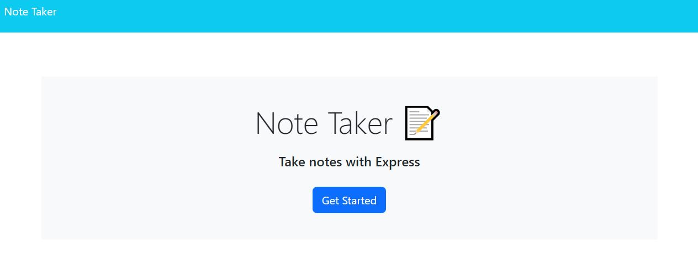
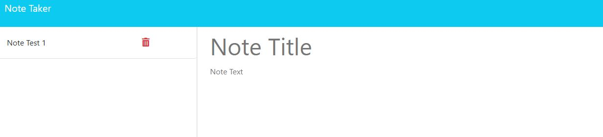

# My Note Taking Application

## Description
This project entailed the addition of a back-end to a front-end application that allows users to write down notes and descriptions and save them to a database to be reminded of them when looking again at the app.

## Installation
No installation necessary, the application can be accessed at the following link: 
[Note Taking Application](https://my-notes-project.onrender.com/)

## Usage
Upon running the application, this is a screenshot of what the landing page will look like:

When you click on the "Get Started" button on the landing page, you will be taken to the notes page where you can see previously logged notes and log new notes:

If the user would like to see the description of a previously logged note, they can click on it on the left-hand sidebar and the right portion of the screen will be populated with the information from that particular note.

## Contributing
N/A

## Tests
N/A

## Credits
The module 11 mini project is referenced throughout the project, as it was used as a guide to create my helper functions and deploy those helper functions in the API routes.